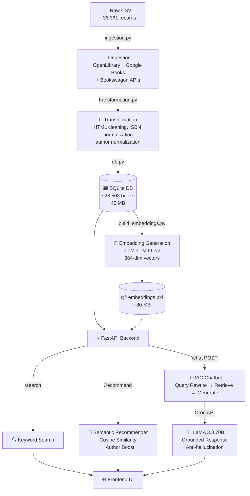

<div align="center">

# 📚 The Reading Room

### *An Intelligent Book Discovery & Conversational Recommendation System*

[](https://www.python.org/)
[](https://fastapi.tiangolo.com/)
[](https://www.docker.com/)

</div>

---

## 📖 Overview

**The Reading Room** is a full-stack, AI-powered book discovery platform that goes beyond keyword search. It combines a **semantic embedding engine** with a **Retrieval-Augmented Generation (RAG) chatbot** so users can explore a curated library of **~28,500 books** by describing themes, moods, plot elements, or having a natural conversation.

Whether you type *"a melancholy story about artificial intelligence"* or ask *"something shorter than that"* as a follow-up — The Reading Room understands context, resolves ambiguity, and surfaces the most relevant titles from the catalog without hallucinating books that don't exist.

---

## ✨ Key Features

| # | Feature | Description |
|---|---------|-------------|
| 1 | **Semantic Search** | Understands intent, mood, and theme — not just keywords |
| 2 | **Hybrid Retrieval** | Blends vector cosine similarity with author-boosted keyword matching |
| 3 | **RAG Chatbot** | Multi-turn conversational interface grounded exclusively in the catalog |
| 4 | **Query Rewriting** | Resolves pronouns and follow-ups into standalone search queries automatically |
| 5 | **Anti-Hallucination** | LLM is hard-constrained to only cite titles present in retrieved context |
| 6 | **End-to-End ETL** | Complete data pipeline: raw CSV → ingestion → cleaning → SQLite → embeddings |
| 7 | **High-Performance API** | Async FastAPI with a singleton recommender loaded at startup |
| 8 | **Dockerized Deployment** | One-command local deployment via Docker |

---

## 🏗️ Architecture

The system is composed of five distinct, loosely coupled layers that flow data from raw sources to the user interface:

```
┌─────────────────────────────────────────────────────────────────────────┐
│                          THE READING ROOM                               │
│                                                                         │
│  ┌──────────┐    ┌──────────────┐    ┌─────────────┐                   │
│  │ Raw Data │───▶│  Ingestion   │───▶│ Transform & │                   │
│  │  (CSV)   │    │  Pipeline    │    │   Clean     │                   │
│  └──────────┘    └──────────────┘    └──────┬──────┘                   │
│                                             │                           │
│                           ┌─────────────────┼──────────────┐           │
│                           ▼                 ▼              │           │
│                    ┌────────────┐   ┌──────────────┐       │           │
│                    │   SQLite   │   │  Embeddings  │       │           │
│                    │  library.db│   │ (80MB .pkl)  │       │           │
│                    └─────┬──────┘   └──────┬───────┘       │           │
│                          │                 │               │           │
│                          ▼                 ▼               │           │
│                    ┌─────────────────────────────┐         │           │
│                    │       FastAPI Backend        │         │           │
│                    │  /search  /recommend  /chat  │         │           │
│                    └──────────────┬──────────────┘         │           │
│                                   │                         │           │
│              ┌────────────────────┤                         │           │
│              ▼                    ▼                         │           │
│    ┌──────────────────┐  ┌────────────────────┐            │           │
│    │  Semantic Engine  │  │   RAG Chatbot      │            │           │
│    │ all-MiniLM-L6-v2 │  │ llama-3.3-70b      │            │           │
│    │ + Cosine Sim.    │  │ (via Groq API)     │            │           │
│    └──────────────────┘  └────────────────────┘            │           │
│                                   │                         │           │
│                                   ▼                         │           │
│                    ┌──────────────────────────┐             │           │
│                    │    Vanilla Frontend       │             │           │
│                    │   (HTML + CSS + JS)       │             │           │
│                    └──────────────────────────┘             │           │
└─────────────────────────────────────────────────────────────────────────┘
```

### Mermaid Diagram



---

## 🤖 Models Used & Why They Are the Best Choice

### 1. `all-MiniLM-L6-v2` — Sentence Transformers *(Retrieval / Embedding)*

| Property | Value |
|----------|-------|
| Dimensions | 384 |
| Parameters | ~22M |
| Speed | ~14,200 sentences/sec (CPU) |
| SBERT Benchmark | Top-tier on STS & semantic search tasks |

**Why this model?**
- **Size-to-performance ratio** is unmatched — at only ~90 MB, it achieves semantic understanding comparable to models 10× larger.
- **CPU-friendly** — critical for Hugging Face Spaces free tier and local development without a GPU.
- **Pre-trained on diverse corpora** (Wikipedia, book abstracts, Reddit, StackExchange) — covers literary vocabulary well.
- **384-dim vectors** are compact enough to fit 28,500 embeddings in ~80 MB of RAM while still being highly discriminative.
- Produces **cosine-comparable embeddings** out of the box, making retrieval implementation simple and correct.

---

### 2. `llama-3.3-70b-versatile` — Meta LLaMA via Groq *(Generation / RAG)*

| Property | Value |
|----------|-------|
| Parameters | 70 Billion |
| Quantization | BF16 (Groq native) |
| Context Window | 128K tokens |
| Inference Speed | ~800 tokens/sec (Groq hardware) |
| API | Groq Cloud (free tier available) |

**Why this model?**
- **70B parameter scale** provides sophisticated reasoning ability — it can infer why a book fits a user's mood from a brief description, then articulate that convincingly.
- **LLaMA 3.3 specifically** outperforms LLaMA 3.1 70B on instruction following, which is critical for our strict anti-hallucination system prompt.
- **Groq's LPU hardware** delivers inference at ~800 tok/s — the RAG response roundtrip feels instantaneous vs. standard GPU endpoints.
- **Large context window (128K)** means we can safely inject the full book catalog context block plus multi-turn conversation history without truncation.
- **Zero cost on free tier** — ideal for academic projects; no billing required for reasonable query volumes.

---

### Why RAG Instead of Pure LLM?

Pure LLMs hallucinate book titles and authors — this is a well-documented failure mode. By using **Retrieval-Augmented Generation**:

1. We first retrieve the **top 5 most relevant books** from our verified catalog.
2. Only those books are injected into the LLM's context.
3. The system prompt **hard-constrains** the model to cite only books present in that context.
4. The result is a chatbot that is *knowledgeable* (LLM) but *grounded in facts* (our data).

---

## 📁 Project Structure

```
The_reading_room/
│
├── 📂 API/
│   ├── main.py               # FastAPI app — all HTTP endpoints
│   └── __init__.py
│
├── 📂 chat/
│   ├── chatbot.py            # RAG pipeline (rewrite → retrieve → generate)
│   └── __init__.py
│
├── 📂 recommender/
│   ├── recommender.py        # BookRecommender class (semantic + keyword)
│   ├── build_embeddings.py   # One-time script to generate embeddings.pkl
│   ├── embeddings.pkl        # Pre-built vectors (~80 MB, tracked with Git LFS)
│   └── patch_metadata.py     # Utility to patch metadata in embeddings
│
├── 📂 ingestion/
│   └── ingestion.py          # Multi-source description scraper pipeline
│
├── 📂 transformation/
│   └── transformation.py     # Data cleaning, ISBN normalization, author normalization
│
├── 📂 storage/
│   ├── db.py                 # SQLite schema + bulk insert helpers
│   └── library.db            # Compiled database (~45 MB, tracked with Git LFS)
│
├── 📂 frontend/
│   ├── index.html            # Single-page application shell
│   ├── app.js                # All UI logic — search, recommend, chat
│   └── styles.css            # Full design system (~22 KB)
│
├── 📂 data/
│   ├── rae/RC_books.csv      # Raw library catalog
│   └── processed/            # Intermediate and clean CSVs
│
├── 📂 logs/                  # Runtime logs
├── 📂 screenshots/           # UI screenshots for documentation
│
├── pipeline.py               # CLI entry point (--ingestion, --db, --api, --all)
├── requirements.txt          # Python dependencies
├── Dockerfile                # Multi-stage container build
├── docker-compose.yml        # Compose config for local container dev
├── start.sh                  # Container startup script
├── .env                      # Local secrets (never committed)
└── .gitignore
```

---

## 🔄 Full Data Pipeline Workflow

The data flows through four sequential stages before the application can serve requests:

```
Stage 1: INGESTION
  RC_books.csv (36,361 raw records)
      │
      ├─▶ OpenLibrary JSON API    (primary — ISBN lookup)
      ├─▶ Google Books HTML       (secondary — scraping synopsis div)
      ├─▶ Bookswagon Scraper      (tertiary — #aboutbook div)
      └─▶ Google Books REST API   (quaternary — title+author fallback)
      │
      ▼
  dau_with_description.csv  (all records, raw descriptions appended)

Stage 2: TRANSFORMATION
  dau_with_description.csv
      │
      ├─▶ HTML entity decoding + tag stripping
      ├─▶ URL removal, control character removal
      ├─▶ Noise ratio filtering (>60% non-alpha → drop)
      ├─▶ Author name normalization (lowercase, no punctuation)
      ├─▶ ISBN padding + validation (drop malformed)
      └─▶ Drop rows with no description
      │
      ▼
  clean_description.csv  (~28,503 valid records)

Stage 3: STORAGE
  clean_description.csv
      │
      └─▶ SQLite INSERT OR IGNORE  (deduplication on isbn UNIQUE)
      │
      ▼
  storage/library.db  (books table, 45 MB)

Stage 4: EMBEDDING
  library.db  (SELECT isbn, title, author, description WHERE description NOT NULL)
      │
      └─▶ "title: description" concatenation
      └─▶ SentenceTransformer('all-MiniLM-L6-v2').encode()
      │
      ▼
  recommender/embeddings.pkl  (80 MB numpy array + metadata dicts)
```

### RAG Chat Pipeline (per request)

```
User Message + History
      │
      ▼
  1. rewrite_query()        → LLaMA resolves follow-ups into standalone query
      │                        (skipped on first turn — no LLM call)
      ▼
  2. recommender.recommend() → Cosine similarity → top 50 candidates
                               + Author keyword boost → top 5 final books
      │
      ▼
  3. build_context()        → Format book metadata into numbered text block
      │                        (titles, authors, year, truncated descriptions)
      ▼
  4. generate_response()    → LLaMA 3.3 70B call via Groq
                               System prompt: "ONLY recommend books in CATALOG"
      │
      ▼
  { reply, books, search_query }  →  Frontend
```

---

## 💻 Local Setup — Step by Step

### Prerequisites

| Requirement | Version | Notes |
|------------|---------|-------|
| Python | 3.11+ | `python --version` to check |
| pip | latest | `pip install --upgrade pip` |
| Git | any | For cloning |
| Git LFS | any | Required for large files |
| Groq API Key | — | Free at [console.groq.com](https://console.groq.com) |
| Docker *(optional)* | 20.10+ | Only for containerized run |

---

### Step 1 — Clone the Repository

```bash
git clone https://github.com/GaUrAnGjJ/The_reading_room.git
cd The_reading_room
```

> **Note:** The repository uses **Git LFS** for `storage/library.db` (~45 MB) and `recommender/embeddings.pkl` (~80 MB). If these files are missing or appear as text pointers, install Git LFS first:
> ```bash
> git lfs install
> git lfs pull
> ```

---

### Step 2 — Create & Activate a Virtual Environment

```bash
# Create virtual environment
python -m venv venv

# Activate — Windows
.\venv\Scripts\activate

# Activate — macOS / Linux
source venv/bin/activate
```

---

### Step 3 — Install Dependencies

```bash
pip install --upgrade pip
pip install -r requirements.txt
```

> **Heads-up:** `sentence-transformers` will automatically download `all-MiniLM-L6-v2` (~90 MB) on first use. This is cached to `~/.cache/huggingface/` and won't re-download on subsequent runs.

---

### Step 4 — Configure Environment Variables

Create a `.env` file in the project root:

```bash
# .env  (never commit this file)
GROQ_API_KEY=your_groq_api_key_here
```

Get your free Groq API key at [https://console.groq.com](https://console.groq.com).

The `.env` file is already in `.gitignore` — it will not be committed.

---

### Step 5 — Initialize the Database (if `library.db` is not present)

> **Skip this step** if `storage/library.db` was pulled via Git LFS.

```bash
# Run only the database initialization stage
python pipeline.py --db
```

This reads `data/processed/clean_description.csv` and populates `storage/library.db`.

---

### Step 6 — Generate Embeddings (if `embeddings.pkl` is not present)

> **Skip this step** if `recommender/embeddings.pkl` was pulled via Git LFS.

```bash
python recommender/build_embeddings.py
```

This step encodes ~28,500 book descriptions using `all-MiniLM-L6-v2`. It takes **10–20 minutes on CPU** and produces `recommender/embeddings.pkl` (~80 MB).

---

### Step 7 — Run the Application

```bash
python pipeline.py --api
```

The server starts on **[http://localhost:7860](http://localhost:7860)**.

You should see:
```
INFO:     Recommender model loaded successfully.
INFO:     Uvicorn running on http://127.0.0.1:7860
```

> The recommender model is pre-loaded at startup to avoid latency on the first request.

---

### Step 8 — Verify the API

Open a new terminal and run a quick smoke test:

```bash
# Health check
curl http://localhost:7860/api/health

# Semantic recommendation
curl "http://localhost:7860/recommend?query=sad+story+about+robots"

# RAG Chat — single turn
curl -X POST http://localhost:7860/chat \
  -H "Content-Type: application/json" \
  -d '{"message": "I want a mystery novel set in Victorian London", "history": []}'

# RAG Chat — multi-turn follow-up
curl -X POST http://localhost:7860/chat \
  -H "Content-Type: application/json" \
  -d '{
    "message": "something shorter than that",
    "history": [
      {"role": "user", "content": "I want a mystery novel set in Victorian London"},
      {"role": "assistant", "content": "<previous reply>"}
    ]
  }'
```

---

## 🐳 Running with Docker

The Dockerfile handles everything automatically — model download, database init, and startup.

```bash
# Build the image  (~5–10 min on first build due to PyTorch + model download)
docker build -t the-reading-room .

# Run the container (port 7860 matches HF Spaces default)
docker run -p 7860:7860 -e GROQ_API_KEY=your_key_here the-reading-room
```

Using Docker Compose:

```bash
# GROQ_API_KEY is read from your shell environment (never hard-code it)
GROQ_API_KEY=your_key_here docker-compose up
```


---

## 🔌 API Reference

| Method | Endpoint | Description |
|--------|----------|-------------|
| `GET` | `/api/health` | Server health check |
| `GET` | `/books/{isbn}` | Fetch a single book by ISBN |
| `GET` | `/search?q=<query>` | Keyword search (title or author) |
| `GET` | `/recommend?query=<query>` | Semantic + author-boosted recommendations |
| `GET` | `/random-books` | 10 random books from the catalog |
| `POST` | `/chat` | RAG chat — accepts `{message, history[]}`, returns `{reply, books, search_query}` |

### POST `/chat` — Request Body

```json
{
  "message": "suggest something dark and philosophical",
  "history": [
    {"role": "user", "content": "...previous user turn..."},
    {"role": "assistant", "content": "...previous assistant turn..."}
  ]
}
```

### POST `/chat` — Response

```json
{
  "reply": "Based on your interest in philosophical themes...",
  "books": [
    {
      "isbn": "9780743273565",
      "title": "The Great Gatsby",
      "author": "f scott fitzgerald",
      "year": 1925,
      "description": "...",
      "poster_url": "...",
      "book_url": "...",
      "score": 0.847
    }
  ],
  "search_query": "dark philosophical literary fiction existential"
}
```

---

## 📊 Dataset & Performance Statistics

### Data Pipeline

| Stage | Records | Notes |
|-------|---------|-------|
| Raw Input | 36,361 | `RC_books.csv` — library accession catalog |
| After Deduplication | ~35,000 | ISBN-based dedup |
| After Description Enrichment | ~35,000 | Multi-source scraping |
| After Transformation & Cleaning | **28,503** | ~21% dropped (no valid description) |

### Description Sources (Cascade Priority)

| # | Source | Method |
|---|--------|--------|
| 1 | **OpenLibrary** | JSON API — `isbn/{isbn}.json` + works endpoint fallback |
| 2 | **Google Books HTML** | BeautifulSoup scrape of synopsis div |
| 3 | **Bookswagon** | BeautifulSoup scrape of `#aboutbook` div |
| 4 | **Google Books REST API** | `intitle:` + `inauthor:` query fallback |

### Technical Metrics

| Metric | Value |
|--------|-------|
| Embedding Dimensions | 384 (all-MiniLM-L6-v2) |
| Database Size | ~45 MB (SQLite) |
| Embeddings Artifact | ~80 MB (Pickle + NumPy) |
| Semantic Search Latency | < 100 ms (CPU) |
| RAG Chat Latency | ~1–2 seconds (Groq network roundtrip) |
| History Window | Last 6 turns (stays within LLM token budget) |
| Max Books Retrieved per Chat | 5 |
| Max Description in Context | 400 chars (truncated at word boundary) |

---

## 🖼️ Screenshots

### Home — Book Discovery Interface


### Semantic Search Results


### Book Shelf — Random Exploration


---

## 🛠️ Technology Stack

| Layer | Technology | Version | Role |
|-------|-----------|---------|------|
| **Language** | Python | 3.11 | Entire backend |
| **Web Framework** | FastAPI | 0.128 | API server |
| **ASGI Server** | Uvicorn | 0.40 | Production-ready async server |
| **Database** | SQLite | — | Relational book store |
| **Data Processing** | Pandas | 2.3.2 | ETL pipeline |
| **Embedding Model** | Sentence Transformers | 3.1.1 | Semantic vector generation |
| **ML Model** | all-MiniLM-L6-v2 | — | 384-dim sentence embeddings |
| **Vector Search** | Scikit-Learn | 1.6.1 | Cosine similarity retrieval |
| **LLM** | LLaMA 3.3 70B | — | RAG response generation |
| **LLM API** | Groq | — | Ultra-fast LPU inference |
| **Web Scraping** | BeautifulSoup4 | 4.12.2 | Description ingestion |
| **HTTP Client** | Requests | 2.28.2 | API calls with retry |
| **Frontend** | Vanilla HTML/CSS/JS | — | Zero-dependency UI |
| **Containerization** | Docker | — | Reproducible builds |
| **Hosting** | Hugging Face Spaces | — | Free-tier deployment |
| **Secrets** | python-dotenv | 1.0.1 | Local `.env` loading |


---

## 👥 Contributors

<div align="center">

| Name | GitHub |
| :--- | :--- |
| **Gaurang Jadav** | [@GaUrAnGjJ](https://github.com/GaUrAnGjJ) |

</div>

---

## 📄 License

This project is developed as an academic project at **DA-IICT** and extende. All data sourced from OpenLibrary, Google Books, and Bookswagon is used in accordance with their respective terms for educational purposes.

---

